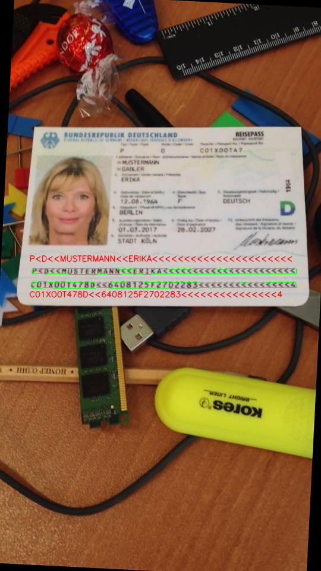
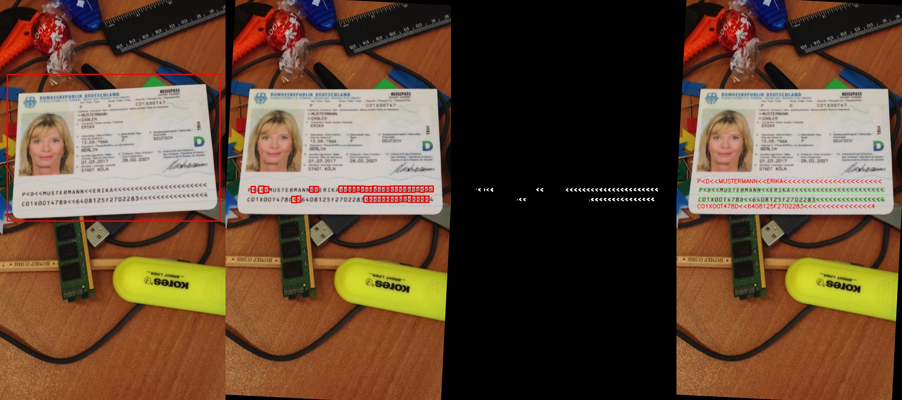

### MRZ READER ##

This is an inference private repository to extract & read MRZ from passports . I did this
prototype as a part of assesment where the challenge was to recover MRZ are from passport
by detecting angled brackets (<)

```
pip3 install -r requirements.txt
python3 main.py

```
#### MRZ EXTRACTION & OCR ####


<p>
    
</p>


#### SOLUTION ####

The solution involves both classic Computer Vision approach & Deep Learning approach. 

Orderwise as in image below, the pipeline starts with document detection by YOLO model.
Followed by deskewing image using hough transform.

From the deskewed image, the angled brackets (<) are detected from which the MRZ area 
is recovered by computing the distance & location of angled brackets & MRZ standards.

The recovered MRZ area is passed to OTSU thresholding & upper half / lower half of MRZ 
is cropped & sent to Convolutional OCR model


<p>
    
</p>


